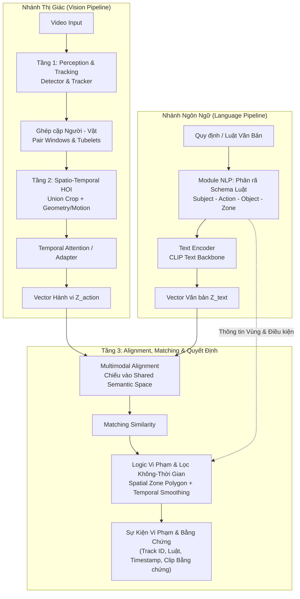

# Temporal HOI Video–Text Matching

> **Kế hoạch hiện hành — 28/09/2026:** xem [kế hoạch 10 tuần](plan.md) và [bảng tiến độ đã cập nhật](outputs/Ke_hoach_do_an_10_tuan.xlsx). Hai hướng hiện tại là phát hiện vi phạm không train/fine-tune riêng theo hành vi và video–text matching bằng mô hình có sẵn. Mỗi tuần một báo cáo tổng hợp, nộp thứ Sáu. Các sơ đồ temporal adapter/alignment có học ở phần dưới là thiết kế trước khi đổi phạm vi, không phải yêu cầu triển khai của lịch mới; hướng dẫn cài môi trường vẫn dùng được.

> **Hệ thống nhận biết tương tác người–vật theo thời gian và so khớp video–văn bản phục vụ phát hiện vi phạm quy định.**

[](https://www.python.org/)
[](https://pytorch.org/)
[](https://github.com/mlfoundations/open_clip)
[](https://docs.astral.sh/uv/)

---

## 1. Giới thiệu tổng quan (Overview)

Trong các hệ thống giám sát an ninh và an toàn lao động, việc phát hiện hành vi vi phạm truyền thống thường dựa trên các bộ phân loại đóng (closed-set classification) với các lớp hành vi định sẵn, gây hạn chế khi cần mở rộng hoặc thay đổi quy định.

Dự án **Temporal HOI Video–Text Matching** nghiên cứu giải pháp phát hiện sự kiện vi phạm linh hoạt bằng cách kết hợp giữa **mô hình hóa tương tác người–vật thể theo thời gian (Spatio-Temporal HOI)** và **so khớp video–văn bản (Video–Text Matching)**. Hệ thống cho phép người dùng định nghĩa quy tắc an toàn bằng văn bản tự nhiên theo mẫu có kiểm soát, nhận diện chuỗi tương tác trong video, đồng thời kiểm tra các điều kiện không gian (vùng quy định) và thời gian (thời lượng duy trì) để đưa ra quyết định cảnh báo kèm bằng chứng trực quan.

### Điểm nổi bật
- **Mô hình hóa tương tác không-thời gian (Spatio-Temporal HOI):** Nắm bắt mối tương quan động giữa người và vật thể (quỹ đạo, khoảng cách tương đối, vận tốc) qua chuỗi khung hình thay vì chỉ nhận diện các vật thể tĩnh đơn lẻ.
- **So khớp đa phương thức (Cross-Modal Matching):** Căn chỉnh không gian biểu diễn giữa chuỗi hành vi video ($Z_{\text{action}}$) và mô tả quy định bằng văn bản ($Z_{\text{text}}$) thông qua kỹ thuật Contrastive Alignment.
- **Suy luận vi phạm có căn cứ (Grounded Decision):** Phân định rạch ròi giữa việc *nhận biết hành vi* (Action Understanding) và *quyết định vi phạm* (Rule/Zone/Time Logic), giúp hạn chế báo động giả (False Alarms) và cung cấp bounding box, track ID, timestamp cùng video bằng chứng.

---

## 2. Kiến trúc Pipeline (System Pipeline)

Hệ thống được thiết kế theo luồng xử lý 3 tầng kết hợp hai nhánh thu nhận thông tin (Thị giác và Ngôn ngữ):



### Chi tiết các tầng xử lý:

1. **Tầng 1 – Perception & Tracking:**
   - Tiếp nhận luồng video giám sát.
   - Phát hiện vị trí (Bounding Box) của Người và Vật thể trong từng khung hình.
   - Bám vết đa đối tượng (Multi-Object Tracking) để duy trì định danh và thiết lập chuỗi quỹ đạo (tubelets) liên tục qua thời gian.

2. **Tầng 2 – Spatio-Temporal HOI Modeling:**
   - Liên kết các cặp đối tượng tiềm năng (Người – Vật) trong cửa sổ thời gian (Pair Windows).
   - Trích xuất đặc trưng ngoại hình (Appearance Feature) qua vùng hộp bao kết hợp (Union Box) sử dụng backbone thị giác (như CLIP Vision).
   - Tích hợp đặc trưng hình học và chuyển động (Geometry & Motion Trajectory: tọa độ tương đối, khoảng cách, vector vận tốc).
   - Sử dụng cơ chế nén thời gian (Temporal Attention / Temporal Adapter) để tổng hợp chuỗi khung hình thành vector đại diện hành vi $Z_{\text{action}}$.

3. **Module NLP – Rule Decomposition & Text Encoding:**
   - Tiếp nhận câu quy tắc an toàn bằng ngôn ngữ tự nhiên theo mẫu chuẩn hóa.
   - Phân rã cấu trúc logic thành tuple: `<Subject, Action, Object, Zone, Condition>`.
   - Chuẩn hóa mô tả hành vi và đưa qua Text Encoder (như CLIP Text) để thu được vector đặc trưng văn bản $Z_{\text{text}}$.

4. **Tầng 3 – Cross-Modal Alignment, Matching & Grounded Decision:**
   - **Multimodal Alignment:** Sử dụng lớp chiếu (Projection Layer) hoặc Contrastive Learning để đưa $Z_{\text{action}}$ và $Z_{\text{text}}$ về cùng không gian ngữ nghĩa chung (Shared Semantic Space).
   - **Matching:** Tính toán điểm tương đồng ngữ nghĩa giữa hành vi quan sát được và nội dung quy định.
   - **Spatial-Temporal Logic:** Kết hợp kiểm tra vùng không gian (Polygon ROI) và thời lượng tối thiểu (Min Dwell Time / Temporal Smoothing) để đưa ra kết luận vi phạm chính xác: *Ai vi phạm (BBox/Track ID), Vi phạm gì (Rule), Ở đâu (Zone), Khi nào (Timestamp) kèm đoạn video bằng chứng (Evidence Grounding)*.

---

## 3. Cấu trúc thư mục (Repository Structure)

```text
├── docs/                      # Tài liệu kỹ thuật, PRD và báo cáo nghiên cứu
│   ├── prd.md                 # Product Requirement Document & đặc tả chi tiết
│   ├── plan.md                # Kế hoạch chi tiết và tiến trình triển khai
│   └── report/                # Các báo cáo tiến độ định kỳ
├── scripts/                   # Scripts kiểm tra môi trường, xử lý dữ liệu và utility
│   └── check_environment.py   # Kiểm tra tính toàn vẹn của môi trường và dependency
├── src/                       # Mã nguồn chính của dự án
│   └── temporal_hoi/          # Package triển khai pipeline xử lý
├── pyproject.toml             # Khai báo cấu hình dự án và dependencies (chuẩn PEP 621)
├── uv.lock                    # Khóa phiên bản dependencies đảm bảo tính tái lập
└── README.md                  # Tài liệu giới thiệu tổng quan dự án
```

---

## 4. Cài đặt & Bắt đầu nhanh (Quickstart)

Dự án sử dụng **Python 3.12** và trình quản lý gói [**uv**](https://docs.astral.sh/uv/) để đảm bảo tính tái lập trên mọi môi trường.

### Yêu cầu tiên quyết
- Python 3.12
- Cài đặt `uv` (nếu chưa có):
  ```powershell
  powershell -ExecutionPolicy ByPass -c "irm https://astral.sh/uv/install.ps1 | iex"
  ```

### Cài đặt môi trường

```powershell
# 1. Đồng bộ môi trường ảo theo file uv.lock (bao gồm cả nhóm dev)
uv sync --locked --group dev

# 2. Kiểm tra tính toàn vẹn của môi trường (PyTorch, TorchVision NMS, CLIP, OpenCV, v.v.)
uv run --frozen python scripts/check_environment.py

# 3. Kiểm tra định dạng và quy tắc code
uv run --frozen ruff check .
```

*Lưu ý: Môi trường mặc định được cấu hình với PyTorch CPU phục vụ phát triển mã nguồn cục bộ. Khi chuyển sang máy huấn luyện GPU chuyên dụng, cấu hình nguồn PyTorch CUDA sẽ được thiết lập theo hướng dẫn trong [PRD](docs/prd.md).*

---

## 5. Tài liệu liên quan (References)

- **[Product Requirements Document (PRD)](docs/prd.md)**: Chi tiết yêu cầu kỹ thuật, phạm vi MVP, schema dữ liệu và tiêu chí nghiệm thu.
- **[Kế hoạch triển khai (plan.md)](plan.md)**: Lộ trình và kiến trúc triển khai từng giai đoạn.
- **[Thư mục Báo cáo hàng tuần (Link Google Drive)](https://drive.google.com/drive/folders/1gzjTKl1uKl0Vh60P39wmgpQdl2FZudV1?hl=vi)**: Thư mục lưu trữ tài liệu, slide và các bản báo cáo tiến độ hàng tuần.


