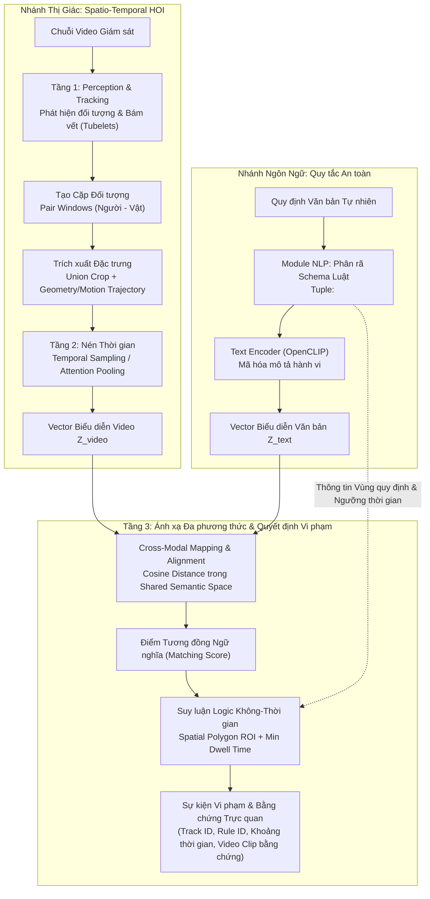

# Temporal HOI Video–Text Matching

> **Nghiên cứu mô hình hóa tương tác người–vật thể theo thời gian (Spatio-Temporal HOI) và so khớp vector biểu diễn ngữ nghĩa video–văn bản phục vụ phát hiện vi phạm quy định có căn cứ bằng chứng trực quan.**

**Người thực hiện:** Ngô Hoàng Phú  

[](https://www.python.org/)
[](https://pytorch.org/)
[](https://github.com/mlfoundations/open_clip)
[](https://docs.astral.sh/uv/)

---

## 1. Đặt vấn đề & Hai Vấn đề Nghiên cứu Cốt lõi (Core Research Problems)

### 1.1. Bối cảnh khoa học
Trong các hệ thống giám sát an ninh (CCTV) tại khu dân cư và đô thị, các giải pháp truyền thống chủ yếu dựa trên bài toán **nhận dạng hành vi tập đóng (*closed-set action recognition*)**. Cách tiếp cận này bộc lộ hạn chế lớn: mỗi khi phát sinh một quy tắc an toàn mới, hệ thống phải thu thập dữ liệu chuyên biệt và huấn luyện lại một mô hình phân loại riêng cho hành vi đó. Đồng thời, các mô hình này thường xem nhẹ mối quan hệ tương tác Người–Vật thể theo thời gian và không phân định được giữa **hành vi thông thường** và **phán quyết vi phạm**.

### 1.2. Hai vấn đề nghiên cứu & phát triển trọng tâm
Dự án tập trung giải quyết hai bài toán khoa học cốt lõi:

1. **Học biểu diễn tương tác Người + Vật thể từ một tập dữ liệu chung cho trước (General HOI Representation Learning):**
   - **Thách thức:** Tránh việc phải huấn luyện mỗi hành vi tương tác trên một tập dữ liệu đặc thù riêng lẻ (task-specific training per behavior).
   - **Hướng tiếp cận:** Mô hình hóa và học biểu diễn tương tác Người + Vật thể theo không–thời gian (*Spatio-Temporal HOI*) từ một tập dữ liệu tương tác tổng quát cho trước. Hệ thống trích xuất đặc trưng ngoại hình từ vùng bao kết hợp (*Union Crop*), tích hợp thông tin hình học và chuyển động tương đối (*Geometry & Motion Trajectory*) qua chuỗi khung hình (*Tubelets / Pair Windows*), và áp dụng cơ chế nén thời gian (*Temporal Sampling / Attention*) để tạo ra vector biểu diễn hành vi $Z_{\text{video}}$ có khả năng khái quát hóa cao cho nhiều tương tác đa dạng.

2. **Ánh xạ và so khớp vector embedding giữa ngữ nghĩa Video và Text (Cross-Modal Embedding Mapping & Matching):**
   - **Thách thức:** Thu hẹp khoảng cách ngữ nghĩa (*Semantic Gap*) giữa chuỗi chuyển động thị giác động trong video và câu mô tả quy tắc bằng văn bản tự nhiên, trong khi các mô hình nền tảng như CLIP vốn được tối ưu chủ yếu cho cặp ảnh tĩnh–văn bản.
   - **Hướng tiếp cận:** Nghiên cứu cơ chế ánh xạ (*mapping / projection*) và căn chỉnh không gian biểu diễn giữa:
     - Vector biểu diễn video $Z_{\text{video}}$ (hành vi nén qua chuỗi khung hình).
     - Vector biểu diễn văn bản $Z_{\text{text}}$ (trích xuất từ mô tả quy tắc tự nhiên qua Text Encoder).
     - Chiếu hai vector về một **không gian ngữ nghĩa chung (*Shared Semantic Embedding Space*)** để so khớp mở (*zero-shot / open-vocabulary matching*), cho phép nhận biết hành vi tương ứng với quy tắc mà không cần gán nhãn đóng.

3. **Cơ chế suy luận vi phạm có căn cứ (*Grounded Verification*):**
   - Phân tách độc lập giữa **nhận biết hành vi** (*Action Understanding*) và **quyết định vi phạm** (*Spatial-Temporal Logic*).
   - Một hành vi chỉ bị kết luận là vi phạm khi đồng thời thỏa mãn: Điểm tương đồng ngữ nghĩa hành vi đạt ngưỡng + Điểm neo đối tượng nằm trong đa giác vùng quy định (Polygon ROI) + Thời lượng duy trì tích lũy vượt ngưỡng tối thiểu (Min Dwell Time).
   - Mọi cảnh báo phát sinh đều đi kèm đầy đủ bằng chứng kiểm chứng: Bounding Box, Track ID, Timestamp và đoạn video bằng chứng.

---

## 2. Kiến trúc Hệ thống (System Architecture)

Quy trình xử lý được thiết kế theo luồng 3 tầng phân định rạch ròi giữa nhận thức thị giác, mã hóa ngôn ngữ và suy luận logic:



### Chi tiết các tầng xử lý:

1. **Tầng 1 – Nhận thức & Bám vết (Perception & Tracking):**
   - Tiếp nhận luồng video, chuẩn hóa tần số khung hình và bảo toàn mốc thời gian (*timestamps*).
   - Xác định bounding box của Người và Vật thể trong từng khung hình.
   - Bám vết đa đối tượng (*Multi-Object Tracking*) tạo thành các chuỗi tubelets liên tục qua thời gian.

2. **Tầng 2 – Biểu diễn Tương tác Người–Vật Không–Thời gian (Spatio-Temporal HOI):**
   - Thiết lập cửa sổ tương tác (*Pair Windows*) giữa người và vật thể tiềm năng.
   - Trích xuất đặc trưng ngoại hình từ vùng bao kết hợp (*Union Crop*) qua Visual Backbone.
   - Tích hợp vector chuyển động và tọa độ tương đối (tâm hộp bao, khoảng cách, biến thiên vận tốc).
   - Lấy mẫu khung hình đồng đều (*Uniform Temporal Sampling*) hoặc áp dụng cơ chế tổng hợp thời gian để tạo vector đại diện hành vi $Z_{\text{video}}$.

3. **Module NLP – Phân rã Quy tắc & Mã hóa Văn bản (Rule Decomposition & Text Encoding):**
   - Phân tích câu quy tắc an toàn tự nhiên thành bộ tham số: `<Chủ thể, Hành động, Đối tượng, Khu vực, Thời lượng>`.
   - Chuẩn hóa mô tả hành vi và đưa qua Text Encoder để sinh vector biểu diễn văn bản $Z_{\text{text}}$.

4. **Tầng 3 – Ánh xạ Ngữ nghĩa & Phán quyết Vi phạm (Alignment & Grounded Verification):**
   - **Cross-Modal Matching:** Tính toán độ tương đồng cosine giữa $Z_{\text{video}}$ và $Z_{\text{text}}$ trong không gian ngữ nghĩa chung.
   - **Spatial-Temporal Logic:** Kiểm tra tọa độ điểm neo đối với đa giác vùng cấm (Polygon ROI) và tính thời lượng duy trì tích lũy ($\Delta t \ge t_{\text{threshold}}$).
   - Xuất sự kiện vi phạm có căn cứ truy vết rõ ràng.

---

## 3. Thiết kế Thực nghiệm Đối chứng (Experimental Design & Baselines)

Nhằm đánh giá khách quan hiệu quả của việc học biểu diễn tương tác chung và cơ chế ánh xạ vector, hệ thống thiết lập ma trận thực nghiệm đối chứng:

| Cấu hình | Biểu diễn Thị giác | Biểu diễn Thời gian | Biểu diễn Hình học/Chuyển động | Mục đích Khoa học |
|---|---|---|---|---|
| **$B_0$ (Global Baseline)** | Toàn khung hình (Global Frame) | Lấy trung bình (Mean Pooling) | Không | Đánh giá ảnh hưởng của bối cảnh nền tĩnh đối với mô hình thị giác |
| **$B_1$ (Local Baseline)** | Vùng bao cặp Người–Vật (Union Crop) | Lấy trung bình (Mean Pooling) | Không | Mốc đối chứng trực tiếp đo lường lợi ích của việc định vị cặp tương tác |
| **$A_1$ (Temporal Ablation)** | Vùng bao cặp Người–Vật (Union Crop) | Temporal Sampling / Attention | Không | Đo lường đóng góp độc lập của cơ chế mô hình hóa chuỗi thời gian |
| **$A_2$ (Geometry Ablation)** | Vùng bao cặp Người–Vật (Union Crop) | Lấy trung bình (Mean Pooling) | Tọa độ tương đối & Vận tốc | Đo lường đóng góp độc lập của vector vị trí và chuyển động tương đối |
| **$P$ (Proposed Method)** | Vùng bao cặp Người–Vật (Union Crop) | Temporal Aggregation | Tọa độ tương đối & Vận tốc | Phương pháp đề xuất đầy đủ, kết hợp đa nguồn đặc trưng và ánh xạ đa phương thức |

---

## 4. Giao thức Đánh giá & Bộ Siêu dữ liệu Benchmark (Benchmark Protocols)

### 4.1. Hệ thống Siêu dữ liệu Benchmark (`data/manifests/`)
Dữ liệu thử nghiệm được quản lý chuẩn hóa nhằm chống rò rỉ dữ liệu (*data leakage*) và đảm bảo tính tái lập:
- `clips.csv`: Danh mục video clip kèm metadata (camera, độ phân giải, fps, khoảng thời gian).
- `texts.csv`: Bộ prompt văn bản chuẩn hóa gồm mô tả hành vi tích cực và âm tính khó (*hard negatives*).
- `splits.csv`: Phân chia tập dữ liệu tách biệt theo `session_id`/`video_id` gốc (tập phát triển `dev` và tập mở rộng `extension`).
- `relevance.csv`: Ma trận gán nhãn liên kết đa nhãn đúng (*multi-positive ground truth*).
- `sources.csv`: Nhật ký nguồn gốc, bản quyền mở và mã băm toàn vẹn (SHA256 checksum) của từng mẫu dữ liệu.

### 4.2. Tiêu chuẩn Đo lường Định lượng
1. **Bài toán So khớp Video–Văn bản (Video–Text Matching):**
   - Hỗ trợ đa nhãn đúng trên từng đoạn clip (*multi-positive ranking*).
   - Độ đo: **Multi-positive Recall@K** ($K=1, 3, 5$), **Pairwise Accuracy** (tần suất chấm điểm cặp đúng cao hơn cặp sai), và **MRR** (*Mean Reciprocal Rank*).
2. **Bài toán Phát hiện Sự kiện Vi phạm Thời gian (Temporal Event Detection):**
   - Sử dụng thuật toán **Ghép 1-to-1 tham lam (Greedy Bipartite Matching)** giữa tập sự kiện dự đoán và nhãn thực tế với ngưỡng chồng lấn thời gian $\text{tIoU} \ge 0.5$.
   - Các dự đoán lặp lại hoặc ngoài khoảng thời gian quy định bị trừng phạt dưới dạng False Positive (FP).
   - Đo lường **Event-Precision**, **Event-Recall**, **Event-F1** và tính toán **Tỷ lệ báo động giả (False Alarms/giờ)** trên video hoạt động bình thường.

---

## 5. Cấu trúc Repository (Repository Structure)

```text
├── configs/                   # Cấu hình thực nghiệm và tham số benchmark
├── data/
│   ├── manifests/             # Siêu dữ liệu benchmark (clips, texts, splits, relevance, sources)
│   │   └── archive/           # Lưu trữ các bản snapshot manifest trước kiểm toán
│   └── raw/                   # Video dữ liệu thực nghiệm (quản lý ngoại tuyến, gitignore)
├── docs/                      # Tài liệu nghiên cứu khoa học
│   └── prd.md                 # Product Requirements Document (PRD) đặc tả chi tiết
├── scripts/                   # Kịch bản kiểm toán dữ liệu và tiện ích thực nghiệm
│   ├── check_environment.py   # Kiểm tra tính toàn vẹn môi trường tính toán
│   ├── audit_data.py          # Kiểm toán dữ liệu và phân bổ nhãn benchmark
│   └── review_samples.py      # Trích xuất contact sheet phục vụ kiểm duyệt nhãn
├── src/                       # Mã nguồn thuật toán và mô hình
│   └── temporal_hoi/
│       ├── data/              # VideoReader (uniform temporal sampling) & TemporalHOIDataset
│       └── evaluation/        # Bộ hàm đo lường (Recall@K, Pairwise Acc, tIoU, Bipartite Matching)
├── tests/                     # Bộ kiểm thử tự động xác minh tính đúng đắn thuật toán
│   ├── test_data.py           # Kiểm thử bộ đọc giải mã khung hình và dataset loader
│   └── test_metrics.py        # Kiểm thử tính toán độ đo, trường hợp biên và ma trận tương đồng
├── pyproject.toml             # Khai báo môi trường và gói phụ thuộc chuẩn PEP 621
├── uv.lock                    # Khóa phiên bản thư viện đảm bảo tính tái lập 100%
└── README.md                  # Giới thiệu tổng quan đề tài và phương pháp nghiên cứu
```

---

## 6. Cài đặt & Tái lập Kết quả (Setup & Reproducibility)

Dự án sử dụng **Python 3.12** kết hợp trình quản lý gói [**uv**](https://docs.astral.sh/uv/) nhằm đảm bảo khả năng tái lập kết quả nghiên cứu trên mọi hệ thống.

### Cài đặt môi trường

```powershell
# 1. Khởi tạo môi trường ảo và đồng bộ thư viện chính xác theo uv.lock
uv sync --locked --group dev

# 2. Xác minh tính toàn vẹn của môi trường nghiên cứu
uv run --frozen python scripts/check_environment.py

# 3. Thực thi toàn bộ bộ kiểm thử tự động
uv run pytest
```

### Sử dụng Module Nghiên cứu trong Thực nghiệm

#### 1. Nạp dữ liệu qua `TemporalHOIDataset`
```python
from temporal_hoi.data import TemporalHOIDataset

dataset = TemporalHOIDataset(
    split="dev",
    clips_csv="data/manifests/clips.csv",
    texts_csv="data/manifests/texts.csv",
    splits_csv="data/manifests/splits.csv",
    relevance_csv="data/manifests/relevance.csv",
    num_frames=8,
    max_frame_side=320,
)

sample = dataset[0]
print(f"Mẫu: {sample['clip_id']} | Số frame: {len(sample['pil_frames'])} | Nhãn vi phạm: {sample['has_violation']}")
```

#### 2. Tính toán độ đo sự kiện với Bipartite Matching ($\text{tIoU} \ge 0.5$)
```python
from temporal_hoi.evaluation import compute_event_metrics

# Dữ liệu sự kiện chuẩn hóa theo giây
ground_truth = [{"video_id": "clip_01", "rule_id": "R01", "start_s": 2.0, "end_s": 8.0}]
predictions  = [{"video_id": "clip_01", "rule_id": "R01", "start_s": 2.2, "end_s": 7.9, "score": 0.88}]

results = compute_event_metrics(ground_truth, predictions, tiou_threshold=0.5)
print(f"Precision: {results['precision']:.3f} | Recall: {results['recall']:.3f} | Event-F1: {results['f1']:.3f}")
```

---

## 7. Tài liệu & Nguồn Tham khảo (References)

- **[Product Requirements Document (PRD)](docs/prd.md)**: Chi tiết hai bài toán nghiên cứu cốt lõi, phạm vi kỹ thuật, các bên liên quan, đặc tả schema và tiêu chí nghiệm thu.
- **Tài liệu học thuật liên quan:**
  - Radford et al., *Learning Transferable Visual Models From Natural Language Supervision (CLIP)*, ICML 2021.
  - Luo et al., *CLIP4Clip: An Empirical Study of CLIP for End to End Video Clip Retrieval*, Neurocomputing 2022.
  - Chuang et al., *VidHOI: Video-and-Language Spatio-Temporal Human-Object Interaction*, TPAMI 2023.
