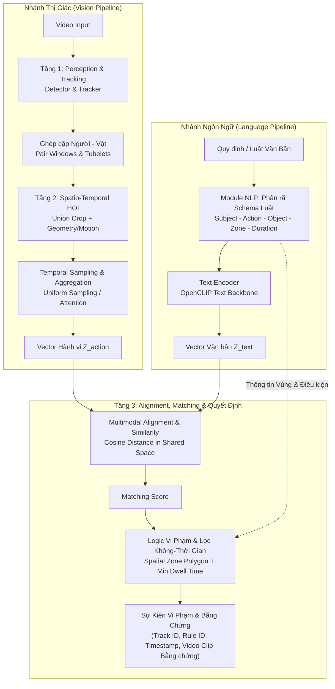

# Temporal HOI Video–Text Matching

> **Hệ thống nhận biết tương tác người–vật thể theo thời gian (Spatio-Temporal HOI) và so khớp video–văn bản (Video–Text Matching) phục vụ phát hiện vi phạm an ninh, trật tự.**

[](https://www.python.org/)
[](https://pytorch.org/)
[](https://github.com/mlfoundations/open_clip)
[](https://docs.astral.sh/uv/)
[]()

---

## 1. Giới thiệu tổng quan (Overview)

Trong các hệ thống giám sát an ninh camera (CCTV) tại khu đô thị và chung cư (khuôn viên, hầm gửi xe, khu tập kết rác, đường nội bộ), việc phát hiện vi phạm quy định thường gặp khó khăn do mô hình phân loại đóng truyền thống không thể thích ứng linh hoạt với các quy định an toàn bằng văn bản tự nhiên.

Dự án **Temporal HOI Video–Text Matching** nghiên cứu giải pháp giám sát an ninh thông minh kết hợp giữa hai hướng tiếp cận bổ trợ:
1. **So khớp Video–Văn bản (Zero-shot Video–Text Matching):** Tận dụng mô hình thị giác–ngôn ngữ lớn tiền huấn luyện (như OpenCLIP) kết hợp lấy mẫu khung hình theo thời gian (Uniform Temporal Sampling) để xếp hạng độ tương quan giữa clip giám sát và các câu mô tả hành vi mà không cần huấn luyện lại từ đầu.
2. **Phát hiện Vi phạm Không–Thời gian (Spatio-Temporal Event Violation Detection):** Phân tách rõ ràng giữa **nhận biết hành vi** (*Action Understanding*) và **quyết định vi phạm** (*Spatial-Temporal Logic*). Kết hợp bám vết đối tượng (Person & Object Tracking), đa giác vùng quy định (Spatial ROI Polygon), và thời lượng duy trì tối thiểu (Min Dwell Time) để xuất sự kiện vi phạm có đầy đủ bằng chứng trực quan (Bounding Box, Track ID, Timestamp, Clip bằng chứng).

### Điểm nổi bật
- **Mô hình hóa tương tác động (Spatio-Temporal HOI):** Nắm bắt mối tương quan chuyển động giữa người và vật thể (quỹ đạo, khoảng cách tương đối, vector vận tốc) qua chuỗi khung hình thay vì phân tích đơn lẻ từng khung tĩnh.
- **Tách biệt hành vi và phán quyết vi phạm:** Một hành vi (ví dụ: dừng xe, để đồ vật) chỉ trở thành vi phạm khi xảy ra tại vùng cấm và vượt quá ngưỡng thời gian quy định, giúp hạn chế báo động giả (False Alarms).
- **Hệ thống đánh giá chặt chẽ:** Tích hợp bộ độ đo truy vấn đa nhãn ($R@1, R@3, R@5$, Pairwise Accuracy, MRR) và thuật toán ghép 1-to-1 tham lam (Greedy Bipartite Matching với ngưỡng $\text{tIoU} \ge 0.5$) để đánh giá sự kiện vi phạm khách quan.

---

## 2. Kiến trúc Pipeline (System Pipeline)

Hệ thống được thiết kế theo luồng xử lý 3 tầng kết hợp hai nhánh thu nhận thông tin (Thị giác và Ngôn ngữ):



### Chi tiết các tầng xử lý:

1. **Tầng 1 – Perception & Tracking:**
   - Tiếp nhận luồng video giám sát (chuẩn hóa tỷ lệ khung hình và timestamp).
   - Phát hiện vị trí (Bounding Box) của Người và Vật thể liên quan trong từng khung hình.
   - Bám vết đa đối tượng (Multi-Object Tracking) để duy trì định danh và thiết lập chuỗi quỹ đạo liên tục.

2. **Tầng 2 – Spatio-Temporal HOI Modeling:**
   - Liên kết các cặp đối tượng tiềm năng (Người – Vật) trong cửa sổ thời gian (Pair Windows).
   - Trích xuất đặc trưng ngoại hình qua vùng hộp bao kết hợp (Union Box) sử dụng backbone thị giác.
   - Tích hợp chuỗi chuyển động và lấy mẫu khung hình đồng đều (Uniform Temporal Sampling) để tổng hợp thành vector đại diện hành vi $Z_{\text{action}}$.

3. **Module NLP – Rule Decomposition & Text Encoding:**
   - Tiếp nhận câu quy tắc an toàn bằng văn bản tự nhiên theo mẫu kiểm soát.
   - Phân rã cấu trúc logic thành bộ tham số: `<Subject, Action, Object, Zone, Min Duration>`.
   - Mã hóa mô tả hành vi qua Text Encoder để thu được vector đặc trưng văn bản $Z_{\text{text}}$.

4. **Tầng 3 – Alignment, Matching & Grounded Decision:**
   - **Matching:** Tính toán độ tương đồng giữa hành vi quan sát được và nội dung quy định trong không gian ngữ nghĩa chung.
   - **Spatial-Temporal Logic:** Kiểm tra tọa độ với vùng đa giác quy định (Polygon ROI) và thời lượng tối thiểu (Min Dwell Time) để kết luận vi phạm chính xác kèm bằng chứng truy vết.

---

## 3. Quy ước Dữ liệu & Chuẩn Đánh giá (Data & Evaluation Standards)

### Cấu trúc siêu dữ liệu (Manifests)
Dữ liệu thử nghiệm được quản lý chặt chẽ qua các bảng danh mục chuẩn hóa trong `data/manifests/`:
- `clips.csv`: Danh mục video clip kèm metadata (camera, độ phân giải, fps, thời lượng).
- `texts.csv`: Bộ prompt văn bản chuẩn hóa gồm mô tả hành vi tích cực và âm tính khó (*hard negatives*).
- `splits.csv`: Phân chia tập dữ liệu tách biệt theo `session_id`/`video_id` gốc để ngăn ngừa rò rỉ dữ liệu (*data leakage*).
- `relevance.csv`: Ma trận gán nhãn liên kết giữa từng clip và câu prompt văn bản.
- `sources.csv`: Nhật ký nguồn gốc, bản quyền và checksum đảm bảo tính toàn vẹn của dữ liệu.

### Tiêu chuẩn đo lường
1. **So khớp Video–Văn bản (Video–Text Matching):**
   - Hỗ trợ đa nhãn đúng (*multi-positive ranking*).
   - Độ đo: **Recall@K** ($K=1, 3, 5$), **Pairwise Accuracy** (tỷ lệ cặp đúng có điểm cao hơn cặp sai), và **MRR** (*Mean Reciprocal Rank*).
2. **Phát hiện Sự kiện Vi phạm (Event Violation Detection):**
   - Khớp nối sự kiện dự đoán với ground-truth bằng thuật toán **Ghép 1-to-1 tham lam (Greedy Bipartite Matching)** với ngưỡng trùng lặp thời gian $\text{tIoU} \ge 0.5$.
   - Các cảnh báo trùng lặp hoặc ngoài khoảng vi phạm bị tính là False Positive (FP).
   - Báo cáo chi tiết **Precision**, **Recall**, **Event-F1** và **Tỷ lệ báo động giả (False Alarms/giờ)** trên video hoạt động bình thường.

---

## 4. Cấu trúc thư mục (Repository Structure)

```text
├── configs/                   # File cấu hình thực nghiệm và tham số benchmark
├── data/
│   ├── manifests/             # Siêu dữ liệu chuẩn hóa (clips, texts, splits, relevance, sources)
│   └── raw/                   # Video giám sát thô (quản lý cục bộ, gitignore)
├── docs/                      # Tài liệu kỹ thuật và đặc tả hệ thống
│   └── prd.md                 # Product Requirements Document & kiến trúc chi tiết
├── scripts/                   # Kịch bản kiểm toán dữ liệu, benchmark và tiện ích
│   ├── check_environment.py   # Kiểm tra tính toàn vẹn của môi trường và thư viện
│   ├── audit_data.py          # Kiểm toán dữ liệu và tính hợp lệ của manifest
│   └── review_samples.py      # Trích xuất ảnh contact sheet phục vụ kiểm duyệt nhãn
├── src/                       # Mã nguồn chính của dự án
│   └── temporal_hoi/
│       ├── data/              # VideoReader (uniform sampling) & TemporalHOIDataset
│       └── evaluation/        # Bộ hàm đo lường (Recall@K, Pairwise Accuracy, tIoU, Bipartite Matching)
├── tests/                     # Bộ kiểm thử tự động toàn diện (unit tests)
│   ├── test_data.py           # Kiểm thử bộ đọc video và dataset loader
│   └── test_metrics.py        # Kiểm thử toán học các độ đo matching và sự kiện
├── pyproject.toml             # Cấu hình dự án và khai báo dependencies chuẩn PEP 621
├── uv.lock                    # Khóa phiên bản thư viện đảm bảo tính tái lập tuyệt đối
└── README.md                  # Tài liệu giới thiệu tổng quan dự án
```

---

## 5. Cài đặt & Bắt đầu nhanh (Quickstart)

Dự án sử dụng **Python 3.12** và trình quản lý gói [**uv**](https://docs.astral.sh/uv/) để đảm bảo tính tái lập trên mọi môi trường.

### Yêu cầu tiên quyết
- Python 3.12
- Cài đặt `uv` (nếu chưa có):
  ```powershell
  powershell -ExecutionPolicy ByPass -c "irm https://astral.sh/uv/install.ps1 | iex"
  ```

### Cài đặt môi trường

```powershell
# 1. Đồng bộ môi trường ảo theo file uv.lock (bao gồm nhóm dev)
uv sync --locked --group dev

# 2. Kiểm tra tính toàn vẹn môi trường (PyTorch, TorchVision NMS, CLIP, OpenCV)
uv run --frozen python scripts/check_environment.py

# 3. Chạy bộ kiểm thử tự động
uv run pytest
```

### Sử dụng mã nguồn cơ bản

#### 1. Đọc dữ liệu với `TemporalHOIDataset`
```python
from temporal_hoi.data import TemporalHOIDataset

dataset = TemporalHOIDataset(
    split="dev",
    clips_csv="data/manifests/clips.csv",
    texts_csv="data/manifests/texts.csv",
    splits_csv="data/manifests/splits.csv",
    relevance_csv="data/manifests/relevance.csv",
    num_frames=8,
    max_frame_side=320,
)

sample = dataset[0]
print(f"Clip ID: {sample['clip_id']}")
print(f"Số khung hình trích xuất: {len(sample['pil_frames'])}")
print(f"Nhãn vi phạm: {sample['has_violation']}")
```

#### 2. Đánh giá sự kiện vi phạm với Bipartite Matching
```python
from temporal_hoi.evaluation import compute_event_metrics

# Định dạng sự kiện: dict chứa start_s, end_s, rule_id, v.v.
gt_events = [{"video_id": "c1", "rule_id": "R01", "start_s": 2.0, "end_s": 8.0}]
pred_events = [{"video_id": "c1", "rule_id": "R01", "start_s": 2.5, "end_s": 7.8, "score": 0.92}]

results = compute_event_metrics(gt_events, pred_events, tiou_threshold=0.5)
print(f"Precision: {results['precision']:.2f}, Recall: {results['recall']:.2f}, F1: {results['f1']:.2f}")
```

---

## 6. Tài liệu liên quan (References)

- **[Product Requirements Document (PRD)](docs/prd.md)**: Chi tiết yêu cầu kỹ thuật, phạm vi MVP, schema dữ liệu và tiêu chí nghiệm thu.
- **[Thư mục Báo cáo định kỳ (Google Drive)](https://drive.google.com/drive/folders/1gzjTKl1uKl0Vh60P39wmgpQdl2FZudV1?hl=vi)**: Thư mục lưu trữ tài liệu, slide thuyết trình và các bản báo cáo định kỳ.
- **Nguồn nghiên cứu liên quan:** [OpenCLIP](https://github.com/mlfoundations/open_clip), [CLIP4Clip](https://github.com/ArrowLuo/CLIP4Clip), [VidHOI](https://github.com/coldmanck/VidHOI).
