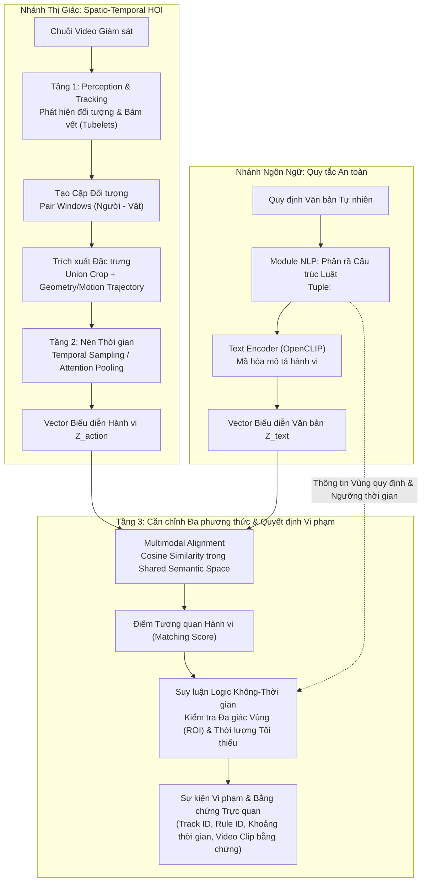

# Temporal HOI Video–Text Matching

> **Nghiên cứu mô hình hóa tương tác người–vật thể theo thời gian (Spatio-Temporal HOI) kết hợp so khớp video–văn bản (Video–Text Matching) nhằm phát hiện sự kiện vi phạm quy định có căn cứ bằng chứng trực quan.**

[](https://www.python.org/)
[](https://pytorch.org/)
[](https://github.com/mlfoundations/open_clip)
[](https://docs.astral.sh/uv/)

---

## 1. Đặt vấn đề & Mục tiêu Nghiên cứu (Problem Formulation & Objectives)

### 1.1. Bối cảnh khoa học
Trong bài toán phân tích hành vi video giám sát, các phương pháp nhận dạng hành vi tập đóng truyền thống (*closed-set action recognition*) phụ thuộc chặt chẽ vào số lượng nhãn cố định và đòi hỏi thu thập dữ liệu huấn luyện lại mỗi khi phát sinh quy định mới. Hơn nữa, việc chỉ phân loại hành động đơn lẻ không phản ánh được bản chất tương tác giữa người và vật thể theo thời gian, đồng thời dễ gây nhầm lẫn giữa **hành vi thuần túy** (ví dụ: dừng xe, đặt đồ vật) và **hành vi vi phạm** (chỉ vi phạm khi đặt sai khu vực quy định hoặc vượt quá thời lượng cho phép).

### 1.2. Mục tiêu nghiên cứu tổng quát
Đề tài tập trung nghiên cứu giải pháp phát hiện sự kiện vi phạm linh hoạt bằng ngôn ngữ tự nhiên thông qua hai trục kỹ thuật cốt lõi:
1. **Mô hình hóa tương tác Người–Vật thể Không–Thời gian (Spatio-Temporal HOI Modeling):** Biểu diễn chuỗi chuyển động, quỹ đạo tương đối và đặc trưng ngoại hình của cặp đối tượng qua thời gian.
2. **So khớp Đa phương thức & Suy luận có Căn cứ (Cross-Modal Matching & Grounded Verification):** Căn chỉnh biểu diễn hành vi video với câu quy định dạng văn bản trong không gian ngữ nghĩa chung, kết hợp kiểm tra điều kiện không gian (Spatial ROI Polygon) và thời gian (Min Dwell Time) để xuất sự kiện vi phạm có đầy đủ bằng chứng truy vết.

### 1.3. Các câu hỏi nghiên cứu (Research Questions)
- **RQ1 (Chính – Spatio-Temporal Modeling vs. Baseline):** Cơ chế tổng hợp thời gian (*Temporal Attention / Temporal Adapter*) kết hợp đặc trưng hình học–chuyển động (*Geometry & Motion Trajectory*) có mang lại hiệu quả nhận biết tương tác vượt trội so với baseline lấy trung bình khung hình (*Global / Union Mean Pooling*) trên cùng một visual backbone và ngân sách tính toán hay không?
- **RQ2 (Hỗ trợ – Cross-Modal Alignment):** Một lớp chiếu / adapter nhỏ (*Projection Layer*) có thể căn chỉnh hiệu quả biểu diễn hành vi nén theo thời gian $Z_{\text{action}}$ với biểu diễn văn bản $Z_{\text{text}}$ từ mô hình ngôn ngữ lớn (như OpenCLIP Text) trong phạm vi dữ liệu giám sát hay không?
- **RQ3 (Kiểm soát Báo động giả – Grounded Decision):** Việc tách bạch độc lập giữa *Module nhận thức hành vi* (Action Understanding) và *Module kiểm tra quy tắc không–thời gian* (Spatial-Temporal Logic) giúp giảm thiểu tỷ lệ báo động giả (*False Alarms/hour*) như thế nào so với các phương pháp phân loại nhị phân vi phạm trực tiếp?

---

## 2. Kiến trúc Hệ thống Đề xuất (Proposed Methodology)

Quy trình xử lý được thiết kế theo kiến trúc 3 tầng phân định rạch ròi giữa nhận thức thị giác, mã hóa ngôn ngữ và suy luận logic:



### Các tầng xử lý chi tiết:

1. **Tầng 1 – Nhận thức & Bám vết (Perception & Tracking):**
   - Giải mã video với tần số lấy mẫu chuẩn hóa, bảo toàn mốc thời gian (*timestamps*).
   - Xác định bounding box của Người và Vật thể liên quan qua từng khung hình.
   - Liên kết quỹ đạo đa đối tượng (*Multi-Object Tracking*) tạo thành các chuỗi tubelets liên tục.

2. **Tầng 2 – Biểu diễn Tương tác Người–Vật Không–Thời gian (Spatio-Temporal HOI):**
   - Thiết lập cửa sổ tương tác (*Pair Windows*) giữa người và vật thể tiềm năng.
   - Trích xuất đặc trưng ngoại hình từ vùng bao chung (*Union Crop*) qua Visual Backbone đóng băng.
   - Bổ sung vector chuyển động tương đối (tọa độ tâm, khoảng cách, biến thiên vận tốc).
   - Sử dụng cơ chế nén thời gian (*Temporal Aggregation / Uniform Sampling*) để tổng hợp thành vector hành vi $Z_{\text{action}}$.

3. **Module NLP – Phân rã Quy tắc & Mã hóa Văn bản (Rule Decomposition & Text Encoding):**
   - Phân tích câu quy tắc bằng ngôn ngữ tự nhiên theo cấu trúc ngữ nghĩa xác định: `[Chủ thể] [Hành động] [Đối tượng] [Khu vực] [Thời lượng tối thiểu]`.
   - Chuẩn hóa mô tả hành vi và chiếu qua Text Encoder để sinh vector biểu diễn văn bản $Z_{\text{text}}$.

4. **Tầng 3 – Căn chỉnh Ngữ nghĩa & Phán quyết Vi phạm (Alignment & Grounded Verification):**
   - **Cross-Modal Matching:** Tính toán độ tương đồng cosine giữa $Z_{\text{action}}$ và $Z_{\text{text}}$ trong không gian ngữ nghĩa chung.
   - **Spatial-Temporal Logic:** Kiểm tra tọa độ điểm neo của người/vật đối với đa giác vùng cấm ($\mathcal{P}_{\text{zone}}$) và tính toán thời lượng duy trì tích lũy ($\Delta t \ge t_{\text{threshold}}$).
   - Sự kiện chỉ được kích hoạt khi đồng thời thỏa mãn cả tương quan ngữ nghĩa hành vi và ràng buộc không–thời gian.

---

## 3. Thiết kế Thực nghiệm & Ma trận Đối chứng (Experimental Setup & Ablation Matrix)

Để trả lời khách quan các câu hỏi nghiên cứu, hệ thống thiết lập ma trận thực nghiệm đối chứng trên cùng tập dữ liệu, cùng visual backbone và cùng ngân sách siêu tham số:

| Cấu hình | Biểu diễn Thị giác | Biểu diễn Thời gian | Biểu diễn Hình học/Chuyển động | Mục đích Khoa học |
|---|---|---|---|---|
| **$B_0$ (Global Baseline)** | Toàn khung hình (Global Frame) | Lấy trung bình (Mean Pooling) | Không | Đánh giá ảnh hưởng của bối cảnh nền tĩnh đối với CLIP |
| **$B_1$ (Local Baseline)** | Vùng bao cặp Người–Vật (Union Crop) | Lấy trung bình (Mean Pooling) | Không | Baseline trực tiếp đo lường lợi ích của việc định vị cặp tương tác |
| **$A_1$ (Temporal Ablation)** | Vùng bao cặp Người–Vật (Union Crop) | Temporal Attention / Sampling | Không | Đánh giá đóng góp độc lập của cơ chế mô hình hóa thời gian |
| **$A_2$ (Geometry Ablation)** | Vùng bao cặp Người–Vật (Union Crop) | Lấy trung bình (Mean Pooling) | Tọa độ tương đối & Vận tốc | Đánh giá đóng góp độc lập của đặc trưng vị trí và chuyển động |
| **$P$ (Proposed Method)** | Vùng bao cặp Người–Vật (Union Crop) | Temporal Attention / Aggregation | Tọa độ tương đối & Vận tốc | Phương pháp đề xuất đầy đủ, kết hợp đa nguồn đặc trưng |

---

## 4. Giao thức Đánh giá & Chuẩn Siêu dữ liệu (Benchmark Protocols)

### 4.1. Hệ thống Siêu dữ liệu Benchmark (`data/manifests/`)
Nhằm loại bỏ hiện tượng rò rỉ dữ liệu (*data leakage*) và đảm bảo tính tái lập khoa học:
- `clips.csv`: Danh mục 8 clip giám sát thực nghiệm kèm độ phân giải, fps, khoảng thời gian thực.
- `texts.csv`: Bộ 20 prompt văn bản chuẩn hóa gồm mô tả hành vi tích cực và các câu âm tính khó (*hard negatives*).
- `splits.csv`: Phân chia tập dữ liệu tách biệt theo `session_id`/`video_id` gốc (tập phát triển `dev` và tập mở rộng `extension`).
- `relevance.csv`: Ma trận gán nhãn tương quan đa nhãn đúng (*multi-positive annotations*).
- `sources.csv`: Thông tin bản quyền, giấy phép mở và mã băm toàn vẹn (SHA256 checksum) của từng mẫu dữ liệu.

### 4.2. Hệ thống Độ đo Đánh giá
1. **Bài toán So khớp Video–Văn bản (Video–Text Retrieval / Matching):**
   - Hỗ trợ đa nhãn đúng trên từng đoạn clip (*multi-positive ground truth*).
   - Độ đo: **Multi-positive Recall@K** ($K=1, 3, 5$), **Pairwise Accuracy** (tần suất chấm điểm cặp đúng cao hơn cặp sai đối chứng), và **MRR** (*Mean Reciprocal Rank*).
2. **Bài toán Phát hiện Sự kiện Vi phạm Thời gian (Temporal Event Detection):**
   - Sử dụng thuật toán **Ghép 1-to-1 tham lam (Greedy Bipartite Matching)** giữa tập sự kiện dự đoán và nhãn thực tế với ngưỡng chồng lấn thời gian $\text{tIoU} \ge 0.5$.
   - Các dự đoán lặp lại hoặc ngoài khoảng thời gian quy định bị trừng phạt dưới dạng False Positive (FP).
   - Đo lường **Event-Precision**, **Event-Recall**, **Event-F1** và tính toán **Tỷ lệ báo động giả (False Alarms/giờ)** trên các video hoạt động bình thường.

---

## 5. Cấu trúc Repository (Repository Structure)

```text
├── configs/                   # Cấu hình thực nghiệm và siêu tham số benchmark
├── data/
│   ├── manifests/             # Siêu dữ liệu benchmark (clips, texts, splits, relevance, sources)
│   │   └── archive/           # Lưu trữ các bản snapshot manifest trước kiểm toán
│   └── raw/                   # Video dữ liệu thực nghiệm (quản lý ngoại tuyến, gitignore)
├── docs/                      # Tài liệu nghiên cứu khoa học
│   └── prd.md                 # Đặc tả yêu cầu kỹ thuật, giả thuyết và kiến trúc chi tiết
├── scripts/                   # Kịch bản kiểm toán dữ liệu và tiện ích thực nghiệm
│   ├── check_environment.py   # Kiểm tra môi trường tính toán (PyTorch, TorchVision, OpenCLIP)
│   ├── audit_data.py          # Kiểm toán tính toàn vẹn và phân bổ nhãn benchmark
│   └── review_samples.py      # Trích xuất contact sheet trực quan hóa mẫu nghiên cứu
├── src/                       # Mã nguồn thuật toán và mô hình
│   └── temporal_hoi/
│       ├── data/              # VideoReader (uniform temporal sampling) & TemporalHOIDataset
│       └── evaluation/        # Module độ đo toán học (Recall@K, Pairwise Acc, tIoU, Bipartite Matching)
├── tests/                     # Bộ kiểm thử tự động xác minh tính đúng đắn thuật toán
│   ├── test_data.py           # Kiểm thử bộ đọc giải mã khung hình và dataset loader
│   └── test_metrics.py        # Kiểm thử tính toán độ đo, trường hợp biên và ma trận tương đồng
├── pyproject.toml             # Khai báo môi trường và gói phụ thuộc chuẩn PEP 621
├── uv.lock                    # Khóa phiên bản thư viện đảm bảo tính tái lập 100%
└── README.md                  # Giới thiệu tổng quan đề tài và phương pháp nghiên cứu
```

---

## 6. Cài đặt & Tái lập Kết quả (Setup & Reproducibility)

Dự án sử dụng **Python 3.12** kết hợp trình quản lý môi trường [**uv**](https://docs.astral.sh/uv/) nhằm đảm bảo khả năng tái lập kết quả nghiên cứu trên mọi hệ thống.

### Cài đặt môi trường

```powershell
# 1. Khởi tạo môi trường ảo và đồng bộ thư viện chính xác theo uv.lock
uv sync --locked --group dev

# 2. Xác minh tính toàn vẹn của môi trường nghiên cứu
uv run --frozen python scripts/check_environment.py

# 3. Thực thi toàn bộ bộ kiểm thử tự động
uv run pytest
```

### Sử dụng Module Nghiên cứu trong Thực nghiệm

#### 1. Nạp dữ liệu qua `TemporalHOIDataset`
```python
from temporal_hoi.data import TemporalHOIDataset

dataset = TemporalHOIDataset(
    split="dev",
    clips_csv="data/manifests/clips.csv",
    texts_csv="data/manifests/texts.csv",
    splits_csv="data/manifests/splits.csv",
    relevance_csv="data/manifests/relevance.csv",
    num_frames=8,
    max_frame_side=320,
)

sample = dataset[0]
print(f"Mẫu: {sample['clip_id']} | Số frame trích xuất: {len(sample['pil_frames'])} | Nhãn vi phạm: {sample['has_violation']}")
```

#### 2. Tính toán độ đo sự kiện với Bipartite Matching ($\text{tIoU} \ge 0.5$)
```python
from temporal_hoi.evaluation import compute_event_metrics

# Dữ liệu sự kiện chuẩn hóa theo giây
ground_truth = [{"video_id": "clip_01", "rule_id": "R01", "start_s": 2.0, "end_s": 8.0}]
predictions  = [{"video_id": "clip_01", "rule_id": "R01", "start_s": 2.2, "end_s": 7.9, "score": 0.88}]

results = compute_event_metrics(ground_truth, predictions, tiou_threshold=0.5)
print(f"Precision: {results['precision']:.3f} | Recall: {results['recall']:.3f} | Event-F1: {results['f1']:.3f}")
```

---

## 7. Tài liệu & Nguồn Tham khảo (References)

- **[Product Requirements Document (PRD)](docs/prd.md)**: Chi tiết câu hỏi nghiên cứu, giả thuyết định hướng, đặc tả schema dữ liệu và tiêu chí nghiệm thu.
- **[Thư mục Báo cáo định kỳ (Google Drive)](https://drive.google.com/drive/folders/1gzjTKl1uKl0Vh60P39wmgpQdl2FZudV1?hl=vi)**: Thư mục lưu trữ tài liệu nghiên cứu, slide bảo vệ và báo cáo chuyên đề định kỳ.
- **Tài liệu học thuật liên quan:**
  - Radford et al., *Learning Transferable Visual Models From Natural Language Supervision (CLIP)*, ICML 2021.
  - Luo et al., *CLIP4Clip: An Empirical Study of CLIP for End to End Video Clip Retrieval*, Neurocomputing 2022.
  - Chuang et al., *VidHOI: Video-and-Language Spatio-Temporal Human-Object Interaction*, TPAMI 2023.
