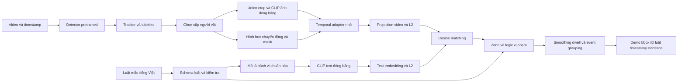

# Kế hoạch đồ án cử nhân trong 10 tuần

**Đề tài dự kiến:** Video–Text Matching for Human–Object Violation Detection  
**Sinh viên:** Ngô Hoàng Phú  
**Thời gian đã xác nhận:** 14/09/2026–22/11/2026, tổng cộng 10 tuần.  
**Nguồn lực đã xác nhận:** 20 giờ/tuần, có thể thuê GPU khi cần.  
**Ngày lập kế hoạch:** 23/09/2026.

Mục tiêu là hoàn thành một đồ án có baseline tái lập được, một cải tiến được kiểm chứng, một sản phẩm demo chạy được và báo cáo giải thích kết quả. Kết quả cử nhân tạo nền tảng dữ liệu, mã nguồn và câu hỏi nghiên cứu cho luận văn thạc sĩ. Không đặt mục tiêu huấn luyện foundation model hoặc giải quyết toàn bộ bài toán giám sát bằng ngôn ngữ tự nhiên trong 10 tuần.

## 1. Căn cứ và những điểm cần điều chỉnh

Kế hoạch dựa trên **Báo cáo tuần 2.docx**, ngày 23/09/2026, gồm các phần Pipeline kiến trúc, RQ1/RQ2, Dataset và Literature Review. Tài liệu đề xuất perception/tracking, ST-HOI, phân rã luật và cross-modal alignment. Đây là nội dung tham khảo để lập kế hoạch, không phải bằng chứng rằng các mô-đun đã được triển khai.

Repo đã khởi tạo tài liệu, package Python và môi trường nền; trạng thái hiện tại nằm trong README và `docs/prd.md`. Các đường dẫn bên dưới là **kiến trúc đề xuất để triển khai dần**, không đồng nghĩa toàn bộ mô-đun đã tồn tại. Excel tại `docs/Ke_hoach_do_an_10_tuan.xlsx` là bản theo dõi công việc; không tự đánh dấu đã hoàn thành dựa trên tên “báo cáo tuần 2”. Nhận xét báo cáo gốc nằm trong `docs/report/week2-review.md`.

Một số phát biểu trong bản dự kiến cần diễn đạt chính xác hơn khi viết báo cáo:

- Hai encoder học độc lập không thể mặc định so cosine có ý nghĩa. Tuy nhiên, image/text encoder của cùng một CLIP đã được tiền huấn luyện để căn chỉnh; baseline CLIP có thể so cosine trực tiếp. Sau khi thêm temporal/geometry encoder, cần huấn luyện hoặc kiểm chứng lại sự căn chỉnh. L2 normalization chỉ chuẩn hóa độ dài vector, không thay thế semantic alignment.
- Chi phí so với K luật ở chiều D là O(KD) cho mỗi embedding video, dù có thể cache text embedding; không nên ghi chung là O(1).
- Cross-attention không mặc nhiên chính xác nhất. Attention map cũng không tự chứng minh được grounding. So sánh chất lượng và định vị phải dùng nhãn, metric và thực nghiệm tương ứng.
- VidHOI và Action Genome hỗ trợ nghiên cứu tương tác/quan hệ, không tự cung cấp đầy đủ luật, vùng, quyền truy cập và nhãn vi phạm. Cần một tập đánh giá vi phạm riêng.

## 2. Phạm vi cử nhân và tiêu chí hoàn thành

### 2.1 Phạm vi bắt buộc

1. Một camera cố định, xử lý video đã ghi. Realtime là mục tiêu phụ chỉ xem xét sau khi demo ngoại tuyến ổn định.
2. Một dataset HOI chính, lấy subset có manifest xác định. Khảo sát dataset thứ hai nhưng không triển khai hai pipeline dữ liệu đầy đủ.
3. Hai đến ba luật thuộc một bối cảnh phòng/lab. Ưu tiên tương tác có thể nhìn thấy với vật đủ lớn: cầm/mang vật trong vùng cấm; cầm/mang vật vượt ranh giới đã khai báo. Dùng luật cấm rõ ràng, không suy diễn “trái phép” từ danh tính hoặc quyền chưa được cung cấp.
4. Các âm tính khó: đi gần vật nhưng không cầm; người mang vật ngoài vùng; vật trong vùng nhưng không có tương tác; người và vật cùng di chuyển do lỗi tracking.
5. Một cải tiến chính: **temporal adapter có đặc trưng hình học/chuyển động cho từng cặp người–vật**, học alignment với text trên nền encoder đóng băng.
6. Demo cho phép chọn video, luật mẫu, vùng; xem người/vật, ID, điểm khớp, thời gian sự kiện và bằng chứng; so baseline với bản cải tiến.
7. Mười báo cáo tuần, báo cáo tổng thể, slide bảo vệ, video demo dự phòng và hướng dẫn tái lập.

Luật tiếng Việt đi qua mẫu câu có kiểm soát, hiển thị cấu trúc đã phân rã cho người dùng kiểm tra. Hành vi được chuyển thành mô tả tiếng Anh chuẩn hóa để dùng với text encoder đã chọn. Chưa khẳng định hỗ trợ mọi câu tiếng Việt, phủ định phức tạp hoặc luật chưa từng gặp.

### 2.2 Ngoài phạm vi mặc định

Full dynamic scene graph/GNN, full cross-modal transformer, huấn luyện detector mới, fine-tune toàn bộ video foundation model, đa camera, nhận dạng danh tính, phân quyền, mobile app và triển khai dịch vụ production. Phát hiện không đeo PPE cần dữ liệu và xử lý bằng chứng vắng mặt; để trong backlog, không gộp vào demo mặc định.

### 2.3 Điều kiện được coi là hoàn thành

| Hạng mục | Bằng chứng phải có |
|---|---|
| Khảo sát | Bảng 8–12 công trình; đọc sâu 5–6 công trình; giải thích lựa chọn bằng dữ liệu, code, tài nguyên và tính phù hợp |
| Baseline | B0/B1 chạy cùng protocol; có config, seed, hash dữ liệu, checkpoint và predictions |
| Cải tiến | Cài mô-đun, kiểm thử loss/mask, learning curve, ablation và phân tích lỗi; phân biệt phần kế thừa với phần tự làm |
| Đánh giá | Bảng validation/test tách biệt; metric đúng đơn vị; số mẫu và hạn chế được công bố |
| Demo | Chạy từ video đến event với predicted tracks; ít nhất 3 kịch bản đối chứng; xuất JSON/CSV/video |
| Bàn giao | Repo tái lập được; báo cáo, slide, video backup; xác định quyền sử dụng dữ liệu/model |

**Ngưỡng mong muốn để định hướng, không phải kết quả đã đạt:** tăng khoảng 2 điểm phần trăm macro-AP so B1 trên validation, hoặc giảm false alarms tại mức recall tương đương sau xử lý luật. Chốt mục tiêu số sau baseline tuần 3. Nếu cải tiến không có lợi, đồ án vẫn cần trình bày kết quả âm, ablation và nguyên nhân; không đổi test hoặc chọn riêng seed đẹp để tạo kết luận tăng điểm.

## 3. Câu hỏi nghiên cứu và thiết kế so sánh

**RQ1:** Trên cùng encoder, dữ liệu và ngân sách huấn luyện, temporal attention kết hợp hình học/chuyển động có giúp phân biệt các tương tác gần nhau hơn mean pooling không?

**RQ2:** Với encoder ảnh/text tiền huấn luyện, một projection và loss nhiều positive có đủ để căn chỉnh biểu diễn cặp tương tác với mô tả hành vi trong phạm vi đã chọn không?

RQ1 là đóng góp thực nghiệm chính. RQ2 là phần triển khai và kiểm chứng cần thiết; chưa coi việc dùng InfoNCE/projection sẵn có là thuật toán mới.

| ID | Cấu hình | Vai trò |
|---|---|---|
| B0 | CLIP từng frame toàn cảnh + mean pooling + cosine | Baseline đơn giản, đo ảnh hưởng của nền |
| B1 | CLIP union crop theo cặp + mean pooling + projection được học | Baseline trực tiếp cho cải tiến; cùng loss và dữ liệu với P |
| A1 | B1 + temporal attention và vị trí thời gian, không geometry | Đo riêng thành phần thời gian |
| A2 | Union feature + geometry/motion + mean pooling, cùng projection | Đo geometry khi chưa có temporal attention |
| P | Union feature + geometry/motion + temporal attention + projection | Phương pháp đề xuất |
| C1 | P với thứ tự temporal token bị shuffle khi đánh giá | Kiểm tra phụ thuộc thứ tự; không tự suy ra nhân quả tuyệt đối |
| C2 | B1 frozen pooled CLIP bỏ projection học, cùng crop/prompt | So sánh phụ về alignment; nêu rõ khác số tham số/trainability |

B1/A1/A2/P dùng cùng split, backbone, số frame, prompt, loss và ngân sách chọn siêu tham số. Báo số tham số trainable để người đọc nhận ra chênh lệch dung lượng. B0 là mốc tham khảo, không dùng riêng B0 để chứng minh lợi ích temporal.

Tách **ablation mô hình** khỏi **ablation hệ thống**: giữ model cố định khi đo không/có zone gate, smoothing và dwell. Không quy cải thiện do hậu xử lý thành cải tiến encoder.

## 4. Lộ trình tìm hiểu mô hình và tài liệu

Không đọc tuần tự mọi bài rồi mới code. Mỗi nhóm bài phải tạo ra một quyết định hoặc một đoạn code kiểm chứng. Tuần 1–2 dành trọng tâm khảo sát; tuần 3 trở đi chỉ đọc thêm để giải quyết lỗi hoặc kiểm tra tính mới.

| Nhóm | Nội dung phải hiểu | Đầu ra học tập | Mức triển khai |
|---|---|---|---|
| CLIP [S1] | Dual encoder, embedding, normalization, contrastive learning, giới hạn ngôn ngữ | Chạy cặp video frame/text; giải thích cosine và similarity | Bắt buộc làm nền |
| CLIP4Clip [S2] | Chuyển từ frame sang clip; mean/sequential/tight matching | So sánh pooling và temporal module | Dùng ý tưởng; chỉ chạy checkpoint khi tương thích |
| ST-HOI/VidHOI [S3] | Box/trajectory, pair feature, oracle và predicted tracks | Sơ đồ schema và adapter dataset | Khảo sát sâu, không bắt buộc tái huấn luyện nguyên repo |
| Action Genome [S4] | Quan hệ attention/spatial/contact, nhãn frame được lấy mẫu | Bảng mapping quan hệ; rủi ro thiếu temporal ID | Dataset dự phòng |
| ByteTrack [S5] | Detection association, ID switch, track lifecycle | Video overlay; bảng lỗi tracking | Thành phần có sẵn cho demo |
| InternVideo2 [S6] | Video-text representation và chi phí backbone | Bảng trade-off, thử inference nếu vừa tài nguyên | So sánh hiện đại tùy chọn |
| InternVideo2.5 [S7] | Video MLLM và ngữ cảnh dài; khác dual-encoder retrieval | Một mục related work, không thay đổi scope | Chỉ khảo sát |
| ST-HOID 2025 [S8] | Định nghĩa instance-level ST-HOI và trajectory | Đối chiếu với RQ, phân biệt VidOR-HOID với VidHOI | Khảo sát tính mới |

Mỗi ghi chú bài báo gồm: bài toán; input/output; dữ liệu/split; kiến trúc; loss; metric; yêu cầu GPU; code/checkpoint/license; điểm có thể tái dùng; giới hạn; quyết định áp dụng. Bổ sung 2–4 công trình 2024–2026 có nguồn gốc rõ ràng trong tuần 2; danh sách trên là điểm xuất phát, không phải tuyên bố đã bao quát SOTA đến 2026.

## 5. Dữ liệu và protocol

### 5.1 Dataset HOI chính

Ưu tiên **VidHOI** nếu tải được video/annotation và ánh xạ lớp cần dùng trong hai ngày đầu tuần 2. Nguồn [S3] mô tả dữ liệu lấy từ VidOR, có trajectory, và lưu ý checkpoint cũ không còn sẵn tại liên kết gốc. Vì vậy, không để tiến độ phụ thuộc tái lập nguyên bản ST-HOI.

Mục tiêu pilot: 20 clip. Sau pilot, khóa subset khoảng 300–600 clip thuộc 3–5 quan hệ phù hợp nếu dữ liệu/tài nguyên cho phép. Đây là ngân sách đề xuất; chọn số thực tế dựa vào số video và phân bố lớp, không bịa đủ mẫu. Lưu `video_id`, `source_video_id`, nhãn, split, timestamp, source/version và checksum.

Giữ train/test chính thức nếu nhãn test truy cập được. Tách validation từ train để chỉnh mô hình. Nếu chỉ có train/val công khai, dùng một phần train làm dev và giữ val chính thức làm local test; gọi tên rõ trong báo cáo. Không tuyên bố kết quả subset/protocol tự chọn tương đương benchmark đầy đủ.

Nếu VidHOI không truy cập được đúng hạn, chuyển **một lần** sang Action Genome [S4]. Nhãn Action Genome nằm ở các frame lấy mẫu; không giả định có sẵn tubelet ID liên tục. Khi chuyển, giảm scope sang quan hệ cầm/chạm, bổ sung association và chỉ đánh giá trên frame/đoạn có nhãn phù hợp. Nếu cả hai đều bị chặn, dùng tập tự quay có consent và ghi rõ benchmark nội bộ, đồng thời thống nhất lại với thầy.

### 5.2 Tập luật dùng cho demo

- Mục tiêu 60 clip ngắn, 3 luật, mỗi luật khoảng 10 positive và 10 negative/hard negative. Nếu gán nhãn vượt ngân sách, giảm còn 40 clip/2 luật; ưu tiên nhãn tốt hơn số lượng.
- Tách theo phiên quay/video gốc, ví dụ 60/20/20 cho phát triển, hiệu chỉnh ngưỡng và test. Tỷ lệ là mục tiêu; ranh giới phiên và độ phủ lớp quan trọng hơn tỷ lệ chính xác. Không cắt các đoạn kề nhau của cùng video sang các split khác nhau.
- Mỗi luật phải có positive và negative ở cả validation/test; thiếu thì thu thêm hoặc bỏ luật trước khi khóa protocol. Với test nhỏ, luôn ghi số event và hạn chế thống kê.
- Ghi `rule_id`, `rule_type`, `subject_track`, `object_track`, `zone_polygon`, `start_s`, `end_s`, `violation`, `evidence_status`. Không nhầm luật “cấm mang vật” với mô tả hành vi “người đang mang vật”.
- Thu thêm khoảng 20 phút video bình thường liên tục để đo false alarms/giờ. Báo cả số báo động và thời lượng thực; không nhân bản/loop clip để tăng giả tạo thời lượng đánh giá.
- Kiểm tra lại ít nhất 20% nhãn; nếu có người thứ hai thì đối chiếu bất đồng, nếu tự kiểm tra thì ghi rõ self-review. Không dùng độ đồng thuận liên người khi chỉ có một người gán nhãn.
- Hoàn tất nhãn và chia tập tuần 4. Test được niêm phong đến tuần 8. Video sân khấu để thuyết trình tách khỏi test để tránh chọn tình huống thuận lợi làm bằng chứng đánh giá.

### 5.3 Metric và cách tính

**HOI/matching:** dùng macro-AP trên các nhãn tương tác đã khóa làm metric chính nếu nhãn đa nhãn đầy đủ; thêm micro-AP và Recall@K theo tập positive. Caption mẫu tạo từ nhãn không phải benchmark free-form retrieval. Với nhiều mô tả cùng đúng, đều phải là positive. Công bố candidate set và số luật khi dùng Recall@K.

**Event vi phạm:** precision, recall, F1 với matching một-một, đúng video và rule, temporal IoU ≥ 0.5. Mỗi ground truth chỉ ghép một prediction; event trùng còn lại là false positive. Báo thêm IoU 0.3 nếu đã định trước. Khi đánh giá “ai vi phạm”, dùng spatial overlap để ghép track thay vì so ID số học giữa hai hệ tracking; nêu cả kết quả temporal-only và kết quả có điều kiện spatial IoU ≥ 0.5 tại các frame gán nhãn.

**Vận hành:** false alarms/giờ trên video không vi phạm; trễ từ lúc sự kiện bắt đầu đến lúc cảnh báo được phát ra; thời gian xử lý/độ dài video, latency/clip, VRAM cực đại. Score cosine không phải xác suất vi phạm. Nếu không có đủ positive/negative để tính một metric, ghi không xác định và nêu mẫu thiếu.

Ngưỡng score, dwell, smoothing, matching và quy tắc chọn checkpoint/seed được ghi trong `configs/evaluation.yaml` trước test. Nếu báo độ trễ online, timestamp phát cảnh báo phải tính cả thời gian đợi cửa sổ; không dùng đầu cửa sổ thay cho thời điểm phát cảnh báo.

Ba seed cho B1 và P nếu pilot cho thấy đủ ngân sách; seed còn lại của ablation chỉ chạy một lần và ghi rõ. Báo mean ± std, số mẫu, kết quả từng seed. Nếu tính bootstrap, lấy mẫu theo video/phiên, không coi các frame cùng video là độc lập. Kết luận bị giới hạn ở tập dữ liệu, camera và lớp đã đánh giá.

## 6. Kiến trúc hệ thống đề xuất



### 6.1 Perception và pair construction

Chọn detector tiền huấn luyện có lớp vật phù hợp sau pilot; khóa tên model, weight hash và license. Dùng ByteTrack hoặc tracker tương đương đã kiểm thử. Detector và backbone đóng băng trong thí nghiệm chính. Giới hạn cặp bằng khoảng cách tương đối/loại vật; không ghép mọi người với mọi vật không kiểm soát.

Giai đoạn học representation dùng annotation/track có sẵn để cô lập lỗi encoder; giai đoạn demo và đánh giá end-to-end phải chạy detector/tracker thật. Bảng kết quả phải ghi rõ **oracle tracks** hay **predicted tracks**; không so hai chế độ để kết luận cải tiến.

### 6.2 Temporal adapter và alignment

Thiết kế khởi đầu: T = 8 hoặc 16 mẫu/cửa sổ 2–4 giây; bước trượt 0.5–1 giây; temporal encoder 1–2 lớp, hidden size khoảng 256. Đây là siêu tham số pilot cần kiểm chứng, không phải cấu hình tối ưu đã biết.

- Appearance `a_t`: CLIP image feature của union crop tại thời điểm t. Có thể thêm person/object riêng nếu còn ngân sách và ablation cho thấy cần.
- Geometry `g_t`: tâm/diện tích box chuẩn hóa, chênh lệch tâm, tỉ lệ kích thước, overlap, vận tốc theo giây và độ tin cậy. Dùng timestamp thật khi video có FPS khác nhau.
- Token `h_t = MLP([a_t, g_t]) + positional_encoding(t)`; áp dụng mask cho frame/track thiếu. Không biến box không quan sát thành box tọa độ 0 rồi coi là hợp lệ.
- Temporal pooling tạo `v`; projection đưa về chiều D của text embedding; L2-normalize trước cosine. Cache text embedding theo nội dung prompt và version encoder.
- Đóng băng CLIP image/text; học adapter và projection video. Text projection là tùy chọn, chỉ thêm khi có đối chứng. Dùng loss contrastive nhiều positive hoặc mask negative cùng nhãn để tránh đẩy hai tương tác đúng giống nhau ra xa.
- Hard negative phải đúng về nhãn: cùng vật nhưng hành động khác, cùng hành động ngoài vùng ở tầng logic. Không đưa khác vùng vào negative semantic nếu mô tả hành vi vẫn đúng và zone được xử lý riêng.

Trước chạy lớn: kiểm tra batch shape, mask, grad và overfit 16–32 mẫu. Learning curve giảm không đủ chứng minh model tốt; phải có validation và baseline.

### 6.3 Luật và suy ra vi phạm

Schema tối thiểu mở rộng tuple trong bản dự kiến:

```yaml
rule_id: R01
text_vi: "Cấm cầm chai trong vùng A"
rule_type: forbidden_action
subject: person
action: holding
object: bottle
zone_id: A
behavior_prompt_en: "a person holding a bottle"
min_duration_s: 1.0
threshold_ref: R01_calibrated_on_validation
```

Điểm giống mô tả hành vi cao chỉ xác nhận **hành vi có khả năng xảy ra**. Với luật cấm, vi phạm cần đồng thời hành vi phù hợp, đối tượng phù hợp, đúng vùng và đủ thời gian. Với luật bắt buộc, không thể coi score thấp là đã chứng minh thiếu hành vi/PPE; loại luật đó nằm ngoài phạm vi mặc định.

Vùng là polygon nhập theo camera, tọa độ chuẩn hóa. Quy định trước điểm neo của người/vật và cách xác định vào/ra vùng. Luật vượt ranh giới cần trạng thái inside/outside qua thời gian, không thể thay bằng membership của một frame. Dwell, hysteresis và dedup chạy theo `(person_id, object_id, rule_id)`. Track mất/che khuất kéo dài trả “chưa đủ bằng chứng” và không tự coi là âm tính.

### 6.4 Hợp đồng dữ liệu giữa mô-đun

| Đối tượng | Trường chính | Quy ước |
|---|---|---|
| Frame | video_id, frame_idx, timestamp_s, image | Timestamp theo video gốc |
| TrackObservation | track_id, class_id, bbox_xyxy, confidence, timestamp_s | Box pixel hoặc normalized phải khai báo rõ |
| PairWindow | pair_id, timestamps, appearance, geometry, valid_mask | Shape `[T,Dv]`, `[T,Dg]`, `[T]`; không trộn người/vật giữa track |
| Rule | rule_id, polarity/type, subject, action, object, zone_id, prompt | Có version và kiểm tra luật được hỗ trợ |
| Prediction | video_id, pair_id, rule_id, score, window_start/end | Score chưa hiệu chỉnh không gọi là probability |
| Event | IDs, rule_id, start/end_s, emitted_at_s, score, evidence_path | Lưu model/config version, chế độ oracle/predicted |

### 6.5 Demo và tiêu chí nghiệm thu

Dùng một giao diện Python nhẹ, đề xuất Gradio, gọi trực tiếp `InferencePipeline`; chưa cần REST service riêng. Các phần: chọn video/luật/vùng; chọn baseline/P; trạng thái xử lý; video overlay; timeline/bảng event; export. Chuẩn bị 3 video: vi phạm đúng, âm tính khó, thất bại/che khuất. Giao diện cần nói rõ offline, phạm vi luật hỗ trợ và các trường hợp thiếu bằng chứng.

Đo hiệu năng trên máy thật trước khi đặt SLA. Demo đạt yêu cầu khi xử lý trọn các video đã chọn, không crash, chỉ rõ nguồn bằng chứng, export đúng schema và tái lập từ môi trường sạch. Gói ngoại tuyến có weight, cấu hình, video backup; không phụ thuộc mạng trong buổi bảo vệ.

## 7. Cấu trúc repo và trách nhiệm các file

```text
temporal-hoi-video-text-matching/
├── README.md                         # Cài đặt, chạy demo, tái lập bảng kết quả
├── plan.md                           # Phạm vi và kế hoạch được thống nhất
├── pyproject.toml                    # Package, dependency, lint/test
├── uv.lock                           # Phiên bản dependency đã khóa bằng uv
├── .python-version                   # Python 3.12 cho môi trường dự án
├── .gitignore                        # Bỏ video, cache, weights, credentials
├── .env.example                      # Tên biến môi trường, không chứa secret
├── configs/
│   ├── data/{vidhoi,demo}.yaml        # Nguồn, manifest, sampling, split
│   ├── model/{b0,b1,temporal}.yaml    # Backbone, shape, frozen/trainable
│   ├── experiments/                  # Mỗi ablation một config có tên ổn định
│   ├── rules/demo.yaml               # Rule schema, prompt, zone references
│   └── evaluation.yaml               # Metric, threshold, event matching
├── src/temporal_hoi/
│   ├── schemas.py                    # Frame, track, pair, rule, event
│   ├── pipeline.py                   # Ghép inference; UI gọi lớp này
│   ├── data/
│   │   ├── datasets.py               # Đọc clip/manifest và batch
│   │   ├── adapters/                 # Adapter cho dataset được chọn
│   │   ├── sampling.py               # Timestamp, window, padding/mask
│   │   └── splits.py                 # Group split và kiểm tra leakage
│   ├── perception/{detector,tracker,pairs}.py
│   ├── features/{appearance,geometry,cache}.py
│   ├── models/{frame_baseline,pair_baseline,temporal_adapter,alignment}.py
│   ├── rules/{schema,parser,prompts,zones}.py
│   ├── training/{trainer,losses,checkpoints}.py
│   ├── inference/{matching,smoothing,events,visualization}.py
│   ├── evaluation/{retrieval,hoi,events,profiling}.py
│   └── utils/{seed,logging,paths}.py
├── scripts/
│   ├── prepare_data.py               # Validate manifest; không nhúng credentials
│   ├── extract_features.py           # Cache theo data/model/config hash
│   ├── train.py                      # Một entry point cho B1/A1/A2/P
│   ├── evaluate.py                   # Cùng evaluator cho mọi cấu hình
│   ├── infer_video.py                # CLI cùng pipeline với demo
│   ├── build_tables.py               # Từ predictions/metrics ra CSV/hình
│   └── smoke_test.py                 # Kiểm tra môi trường và mẫu nhỏ
├── apps/demo/                        # UI và callback; không chứa logic training
├── tests/
│   ├── fixtures/                     # Dữ liệu synthetic nhỏ, không nhạy cảm
│   ├── test_splits.py                # Video/session không giao nhau
│   ├── test_sampling.py              # Mask, FPS, timestamp
│   ├── test_geometry.py              # Box và velocity đúng đơn vị
│   ├── test_loss.py                  # Multi-positive và false negatives
│   ├── test_metrics.py               # Ví dụ tính tay, duplicate events
│   ├── test_events.py                # Zone, hysteresis, track mất
│   └── test_pipeline.py              # Video mẫu đến output schema
├── data/
│   ├── README.md                     # Nguồn/license/hướng dẫn tải/schema
│   ├── manifests/                    # Metadata và split nhỏ, có thể version
│   ├── raw/                          # Git-ignore; giữ nguyên dữ liệu gốc
│   ├── processed/                    # Git-ignore; dữ liệu đã chuyển đổi
│   └── features/                     # Git-ignore; cache + checksum
├── checkpoints/                      # Git-ignore; manifest/hash ở docs hoặc run
├── experiments/
│   ├── registry.csv                  # run_id, commit, config, seed, metric, GPU-hours
│   └── ablation/                     # Config/result summary nhỏ có version
├── outputs/
│   └── runs/<run_id>/                # config, metrics, predictions, logs; ignore file lớn
├── docs/
│   ├── prd.md                        # Scope MVP và tiêu chí nghiệm thu
│   ├── Ke_hoach_do_an_10_tuan.xlsx    # Bản theo dõi tiến độ
│   ├── report/                       # Báo cáo gốc và nhận xét nội dung
│   ├── problem_statement.md
│   ├── literature/{matrix.csv,notes/}
│   ├── decisions/                    # ADR: lý do chọn dữ liệu/model/scope
│   ├── evaluation_protocol.md
│   ├── annotation_guide.md
│   ├── demo_guide.md
│   ├── reproduce.md
│   ├── review_feedback.md
│   ├── defense_qa.md
│   ├── handover.md
│   └── masters_backlog.md
├── reports/
│   ├── weekly/week_01.md … week_10.md
│   ├── thesis/                       # Chương nguồn và bản xuất cuối
│   ├── figures/                      # Hình có script tái tạo
│   ├── tables/                       # CSV sinh tự động, không sửa số bằng tay
│   ├── analysis/                     # Ca lỗi và diễn giải ablation
│   └── slides/
├── notebooks/                        # EDA/khảo sát; không là pipeline chính
├── assets/demo/                      # Clip nhỏ có quyền chia sẻ/video backup
└── dist/                             # Gói bàn giao, thường Git-ignore
```

Tạo dần: tuần 1–2 dựng package/data/docs; tuần 3 baseline/evaluation; tuần 4 perception/features/demo; tuần 5–6 model/training; tuần 7 inference/rules; tuần 8–10 hoàn thiện reports và dist. Không tạo hàng loạt file rỗng chỉ để giống sơ đồ.

Giữ dependency một chiều: `schemas/utils → data/perception/features → models → training hoặc inference → pipeline → apps`. Evaluator đọc predictions theo schema, không phụ thuộc UI. `train.py`, `evaluate.py`, `infer_video.py` là wrapper mỏng; notebook không nắm logic sản phẩm.

Quy ước lệnh dự kiến, chỉ dùng sau khi triển khai entry point:

```bash
python scripts/prepare_data.py --config configs/data/vidhoi.yaml
python scripts/extract_features.py --config configs/model/b1.yaml
python scripts/train.py --config configs/experiments/p_seed42.yaml
python scripts/evaluate.py --run outputs/runs/<run_id> --split test
python scripts/infer_video.py --video <path> --rules configs/rules/demo.yaml
```

Mỗi run lưu config đã resolve, commit, seed, versions, nguồn weight/hash, split hash, label/prompt version, metrics, predictions, thời gian và GPU-hours. Cache key phải chứa data/model/preprocessing version để tránh dùng feature cũ. Commit code, config, metadata và bảng tóm tắt nhỏ; không commit dataset/weight/secret. Chỉ thêm CI tối thiểu cho lint và test quan trọng sau baseline; không cần hạ tầng MLOps lớn.

## 8. Tiến độ 10 tuần và quỹ thời gian

Mỗi tuần **20 giờ = 15 giờ công việc chính + 3 giờ báo cáo tuần/gặp thầy + 2 giờ dự phòng**. Tổng 200 giờ gồm 150 giờ chính, 30 giờ báo cáo tuần và 20 giờ dự phòng. Công việc viết báo cáo tổng thể nằm trong 150 giờ chính từ tuần 3, không để dồn vào cuối kỳ. Thời gian chờ GPU chạy không mặc định là giờ lao động; theo dõi GPU-hours riêng.

Tuần 1 đã qua tại ngày lập kế hoạch. Chưa có bằng chứng hoàn thành từng việc, nên cần đối chiếu đầu tuần 2. 200 giờ là ngân sách cả kỳ, không phải quỹ còn lại; tuần 2–10 có 180 giờ danh nghĩa, trong đó một phần tuần 2 đã trôi qua. Không kéo deadline để bù tuần 1. Dùng dự phòng tuần 2–3 cho việc nền tảng còn thiếu; giảm số bài đọc sâu, số lớp/subset và bỏ benchmark tùy chọn trước khi vượt 20 giờ/tuần.

| Tuần | Thời gian năm 2026 | Trọng tâm và đầu ra | Báo cáo với thầy |
|---|---|---|---|
| 1 | 14/09–20/09 | Chốt bài toán và nền tảng. G1: Có phạm vi, RQ, danh sách đọc và môi trường chạy mẫu | Bài toán, giới hạn, 2 RQ và sơ đồ kiến trúc sơ bộ |
| 2 | 21/09–27/09 | Chọn dữ liệu và khóa protocol. G2: Đọc được dữ liệu thật; có split, metric và phương án dự phòng | So sánh VidHOI/Action Genome; dữ liệu sẵn có; protocol và rủi ro tài nguyên |
| 3 | 28/09–04/10 | Baseline tái lập được. G3: B0 và B1 xuất điểm, dự đoán và bảng kết quả validation | Baseline, dữ liệu đã khóa, lỗi điển hình và thời gian chạy |
| 4 | 05/10–11/10 | Cặp tương tác và demo khung. G4: Video qua detector/tracker đến giao diện; kiểm tra tubelet và nhãn | Video overlay ID, lỗi perception, mockup demo và thiết kế adapter |
| 5 | 12/10–18/10 | Huấn luyện cải tiến chính. G5: Temporal adapter học được; có đối chiếu B1 trên validation | Cấu trúc mô-đun, loss, learning curve và phân tích cải thiện/chưa cải thiện |
| 6 | 19/10–25/10 | Ablation và chọn mô hình. G6: Chọn một cấu hình; kết luận trung thực về đóng góp; dừng mở rộng | Bảng ablation, temporal shuffle và quyết định giữ/bỏ từng thành phần |
| 7 | 26/10–01/11 | Luật, vùng và cảnh báo sự kiện. G7: Demo trả ID, luật, đoạn thời gian, bbox và bằng chứng | Video demo đầu-cuối, ngưỡng validation, false alarm và ca chưa đủ bằng chứng |
| 8 | 02/11–08/11 | Khóa thực nghiệm và kiểm thử demo. G8: Test cuối có số liệu cố định; demo chạy bằng predicted tracks | Bảng kết quả cuối, baseline/cải tiến, chi phí tính toán và giới hạn tổng quát hóa |
| 9 | 09/11–15/11 | Ổn định sản phẩm và sửa báo cáo. G9: Bản release candidate, báo cáo đã sửa và video dự phòng | Checklist góp ý của thầy, khả năng tái lập và kịch bản bảo vệ |
| 10 | 16/11–22/11 | Bàn giao và bảo vệ. G10: Nộp đủ repo, báo cáo, slide, demo và gói tái lập | Tổng kết 10 tuần, đóng góp có bằng chứng và hướng phát triển thạc sĩ |

### Nhịp làm việc hằng tuần

- Buổi đầu: rà milestone, phản hồi thầy, việc phụ thuộc và dữ liệu/GPU cần chuẩn bị.
- Các buổi giữa tuần: 15 giờ việc chính được chia thành 4 gói 4/4/4/3 giờ trong Excel; làm đầu ra nhỏ và có thể kiểm tra.
- Hai giờ dự phòng: xử lý lỗi/việc trễ. Nếu không cần, dùng kiểm tra tái lập và chất lượng báo cáo. Không tự thêm mục tiêu nghiên cứu mới.
- Ba giờ báo cáo tuần: khoảng 1.5 giờ tổng hợp kết quả, 1 giờ trao đổi và 0.5 giờ cập nhật quyết định/kế hoạch. Ngày báo cáo dự kiến là thứ Sáu; có thể đổi ngày trong tuần ở Excel theo lịch thầy.

**Các mốc đóng phạm vi:** cuối tuần 2 chốt dữ liệu/protocol; cuối tuần 3 có baseline; cuối tuần 6 khóa model và siêu tham số chính; tuần 7 khóa threshold demo; tuần 8 test cuối và bản nháp báo cáo đầy đủ; tuần 9 sửa/diễn tập; tuần 10 chỉ sửa lỗi nghiêm trọng, đóng gói và bảo vệ.

## 9. Báo cáo tuần và báo cáo tổng thể

Mỗi báo cáo tuần khoảng 1–2 trang, kèm bảng/hình hoặc đường dẫn minh chứng:

1. Mục tiêu tuần và việc thực tế đã hoàn thành theo task ID.
2. Kiến thức tìm hiểu: mô hình/ý tưởng gì, áp dụng hoặc loại bỏ vì sao.
3. Kết quả định lượng: dataset/split, metric, cấu hình, run_id. Chưa có kết quả thì ghi đang thử/không chạy được.
4. Một hình/sơ đồ/video tiêu biểu; từ tuần 3 có bảng baseline/thực nghiệm.
5. Vấn đề gặp, nguyên nhân đang biết, cách xử lý và hỗ trợ cần từ thầy.
6. Quyết định cần trao đổi, phản hồi của thầy và hành động tiếp theo.
7. Kế hoạch tuần sau với đầu ra, tiêu chí hoàn thành và ước lượng giờ.

Excel có một hàng/tuần để lưu ngày dự kiến, ngày nộp thực tế, link báo cáo, kết quả, khó khăn, góp ý và hành động. Trạng thái báo cáo chỉ là “đã ghi nhận nộp” khi có cả ngày nộp và đường dẫn; ô trống không được hiểu là đã nộp. Đây là tracker, không tự gửi báo cáo cho thầy.

Đề cương báo cáo tổng thể, điều chỉnh theo mẫu của trường:

| Chương | Nội dung | Bản nháp đầu |
|---|---|---|
| 1 | Bài toán, động cơ, phạm vi, RQ và đóng góp dự kiến | Tuần 3 |
| 2 | HOI, temporal modeling, video-text, related work và khoảng trống | Tuần 3 |
| 3 | Kiến trúc, tensor/schema, loss, luật và phần cải tiến | Tuần 5 |
| 4 | Dataset/split, setup, baseline, ablation, thống kê và lỗi | Tuần 6; điền test tuần 8 |
| 5 | Thiết kế demo, triển khai, thử nghiệm người dùng/kịch bản và hiệu năng | Tuần 7 |
| 6 | Kết luận, giới hạn, kết quả âm và hướng thạc sĩ | Tuần 8 |
| Phụ lục | Config, hướng dẫn tái lập, schema, luật mẫu và hướng dẫn demo | Tuần 8–9 |

## 10. Thuê GPU và kiểm soát rủi ro

Tuần 2 đo pilot trước khi thuê dài hạn. Thử một GPU khoảng 16–24 GB VRAM cho feature extraction/adapter nhỏ, nhưng xác nhận thực tế theo backbone/batch. Đây là cấu hình khởi đầu đề xuất, không phải cam kết bộ nhớ đủ. Dùng mixed precision nếu ổn định, giảm batch/T và cache feature khi cần. Chưa có ngân sách tiền cụ thể nên không giả định mức chi.

Ghi giá/giờ tại thời điểm thuê, số giờ dự kiến, dung lượng lưu trữ, phí dữ liệu và cơ chế dừng máy. Ước lượng `GPU-hours = tổng thời gian các run thực đo`, tiền dự kiến = GPU-hours × giá thực tế + lưu trữ/truyền tải. Chạy pilot 1–2 giờ, xem log rồi mới chạy lô. Dừng instance sau mỗi đợt, giữ checkpoint bên ngoài ổ đĩa tạm. Không cần GPU lớn để chạy toàn bộ tuần nếu đã cache feature.

| Rủi ro | Mốc phát hiện | Hành động và phần được cắt |
|---|---|---|
| Thiếu công việc tuần 1 | Đầu tuần 2 | Dùng tối đa dự phòng tuần 2–3; giảm khảo sát phụ, giữ smoke test/dữ liệu/protocol |
| Dataset/weight không tải được | Sau 2 ngày kiểm tra tuần 2 | Đổi sang dữ liệu dự phòng; không phụ thuộc checkpoint ST-HOI cũ |
| GPU/chi phí vượt khả năng | Pilot tuần 2 | Frozen feature, subset nhỏ, T=8; bỏ foundation-model benchmark |
| Ít positive hoặc false negative nhãn | Tuần 2–4 | Giảm lớp/luật, sửa nhãn/mask; không gọi nhãn vắng mặt là negative mặc định |
| Tracker không ổn định | Tuần 4 | Tách oracle/predicted evaluation; chọn vật lớn và camera cố định; giữ phân tích lỗi |
| Temporal model không cải thiện | Tuần 5–6 | Kiểm tra pipeline/loss; giữ kết quả âm, chọn model triển khai tốt nhất bằng validation |
| Không đủ thời gian chạy nhiều cấu hình | Cuối tuần 5 | Giữ B1/P và ablation temporal/geometry; bỏ C2 và benchmark ngoài; công bố số seed thực chạy |
| Viết báo cáo bị trễ | Cuối tuần 6/8 | Khóa tính năng, chuyển dự phòng sang viết; không đẩy bản nháp toàn bộ qua tuần 8 |
| Demo lỗi khi bảo vệ | Tuần 9 | Gói ngoại tuyến, chạy môi trường sạch, video backup và dữ liệu mẫu |

Thứ tự ưu tiên khi bị trễ: **protocol đúng → baseline → một cải tiến có ablation → demo ổn định → báo cáo đầy đủ**. Cắt realtime, mô hình lớn, luật bổ sung và giao diện nâng cao trước. Mọi đổi phạm vi ghi trong `docs/decisions/` và báo lại thầy.

## 11. Tiền đề cho luận văn thạc sĩ

Tài sản cần giữ sau cử nhân: dataset adapters, split/manifests, protocol, baseline tái lập, registry thí nghiệm, tập luật và ca lỗi, pipeline demo tách mô-đun, nhật ký các giả thuyết chưa được chứng minh.

| Hướng tiếp nối | Câu hỏi nghiên cứu mới | Điều kiện trước khi triển khai |
|---|---|---|
| Dynamic HOI graph | Quan hệ đa người/đa vật có tốt hơn pair encoder khi tăng độ phức tạp cảnh? | Dữ liệu/nhãn đủ và baseline pair ổn định |
| Token/frame cross-attention | Fine-grained alignment có cải thiện grounding ngoài lợi ích backbone? | Temporal ground truth và ablation tách yếu tố |
| Compositional generalization | Mô hình có hiểu tổ hợp subject/action/object hoặc luật chưa gặp? | Split tổ hợp chưa thấy; kiểm soát paraphrase và leakage |
| Luật bắt buộc/phủ định | Khi nào đủ bằng chứng để kết luận không tuân thủ? | Nhãn visibility, uncertainty và logic temporal rõ |
| Domain adaptation | Chuyển camera/bối cảnh có giữ chất lượng và calibration? | Nhiều môi trường độc lập, protocol out-of-domain |
| Giám sát dài hạn | Trade-off false alarms, recall và độ trễ thế nào? | Video dài, nhãn sự kiện, tài nguyên đánh giá |

Cuối tuần 10 chọn **một** hướng ưu tiên dựa trên lỗi đã quan sát, không coi toàn bộ bảng là cam kết phải làm trong cử nhân.

## 12. Cách dùng Excel

- `Tien do tuan`: mục tiêu, ngày, milestone, tổng giờ và tiến độ có trọng số theo giờ kế hoạch.
- `Cong viec`: 60 gói việc có ID, phụ thuộc, đầu ra, tiêu chí, hạn, giờ kế hoạch/thực tế, phần trăm hoàn thành và minh chứng.
- `Bao cao tuan`: 10 lần báo cáo; ngày dự kiến, ngày nộp, minh chứng, góp ý, quyết định và việc tuần sau.
- `Thiet lap`: ngày bắt đầu, ngày cập nhật, 20 giờ/tuần, ngày báo cáo trong tuần, hướng dẫn và nguồn.

Ô vàng nhạt là nơi nhập. Nhập 0% cho việc đã xác nhận chưa làm, 100% khi đạt tiêu chí; để trống khi chưa đối chiếu. Tổng tiến độ chỉ hiển thị khi mọi việc trong phạm vi tổng hợp có phần trăm, tránh biến dữ liệu chưa biết thành 0%. Giờ thực tế để trống khi chưa ghi nhận; chỉ so với kế hoạch khi dữ liệu đủ. Hai giờ dự phòng/tuần vẫn thuộc tải 20 giờ nhưng không tham gia phần trăm tiến độ; ghi giờ thực tế và nội dung sử dụng khi cần.

Thay ngày bắt đầu trong Excel sẽ dịch lịch Excel; đây là tiện ích lập lại lịch, không tự thay deadline 22/11/2026 đã thống nhất hoặc nội dung file Markdown. Đổi phạm vi, số giờ, số task hay mốc trong Excel cần đối chiếu lại `plan.md`. Bộ công thức được thiết kế cho 60 task/10 tuần hiện tại; khi thêm hàng phải mở rộng phạm vi tổng hợp.

## 13. Nguồn tham khảo

Nguồn kỹ thuật được đối chiếu ngày 23/09/2026. Các mốc, số giờ, kích thước subset và mục tiêu định lượng là **đề xuất kế hoạch**, không phải số liệu trích từ bài báo.

- Tài liệu người dùng: *Báo cáo tiến độ thực hiện đề tài – Tuần 2*, Ngô Hoàng Phú, 23/09/2026; các mục 2–6.
- [S1 — CLIP, mã nguồn chính thức](https://github.com/openai/CLIP).
- [S2 — CLIP4Clip, mã nguồn chính thức](https://github.com/ArrowLuo/CLIP4Clip).
- [S3 — ST-HOI và VidHOI, mã nguồn và hướng dẫn dữ liệu](https://github.com/coldmanck/VidHOI).
- [S4 — Action Genome, CVPR 2020](https://openaccess.thecvf.com/content_CVPR_2020/html/Ji_Action_Genome_Actions_As_Compositions_of_Spatio-Temporal_Scene_Graphs_CVPR_2020_paper.html) và [hướng dẫn dữ liệu chính thức](https://github.com/JingweiJ/ActionGenome).
- [S5 — ByteTrack, mã nguồn chính thức](https://github.com/FoundationVision/ByteTrack).
- [S6 — InternVideo2, nhánh multimodality chính thức](https://github.com/OpenGVLab/InternVideo/blob/main/InternVideo2/multi_modality/README.md).
- [S7 — InternVideo2.5, tài liệu chính thức](https://github.com/OpenGVLab/InternVideo/blob/main/InternVideo2.5/README.md).
- [S8 — Spatial-Temporal Human-Object Interaction Detection, arXiv 2025](https://arxiv.org/abs/2508.17270).
